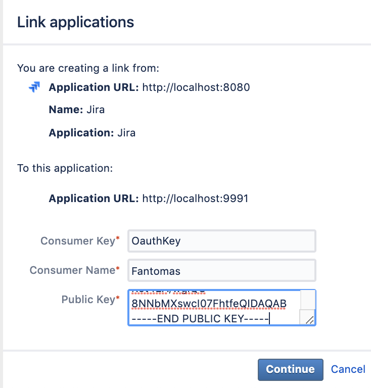
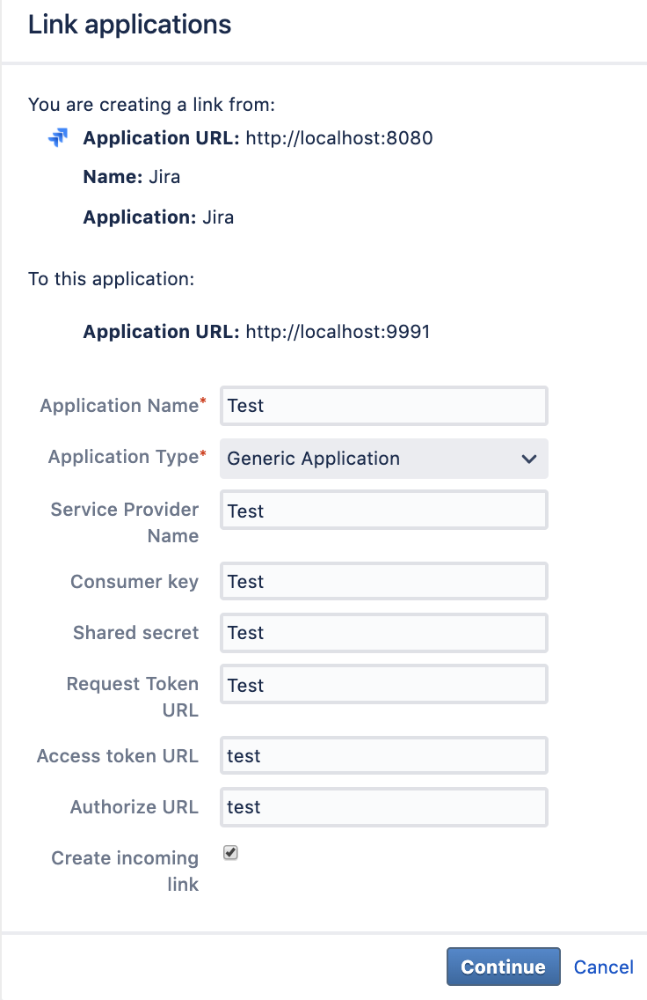
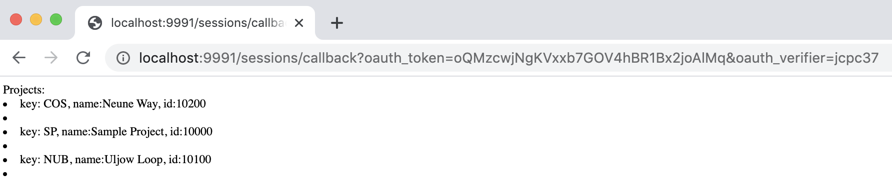

# Nodejs client makes Jira API request authorized via Oauth1. 

Based on [oauth](https://www.npmjs.com/package/oauth) node module.
See [Atlassian documentation](https://developer.atlassian.com/server/jira/platform/oauth/#step-1-configure-jira) to get the required oauth keys and generating the Private key.
 
## Pre-requisites
* Generate an RSA public/private key pair
* Copy private key to the root of app's directory

* Configure Application Link:




* Use your consumerKey, private key file and jira server url in config.js

```
const config = {
  consumerKey: "OauthKey",
  consumerPrivateKeyFile: "./jira_privatekey.pem",
  jiraUrl: "http://0.0.0.0:5472" 
};

module.exports = config;
```

## Confirm it works
* ```npm start``` to run it with nodemon, or ```node index.js```
* go to localhost:<port>/connect, you will be redirected to login to Jira. You should see results:


